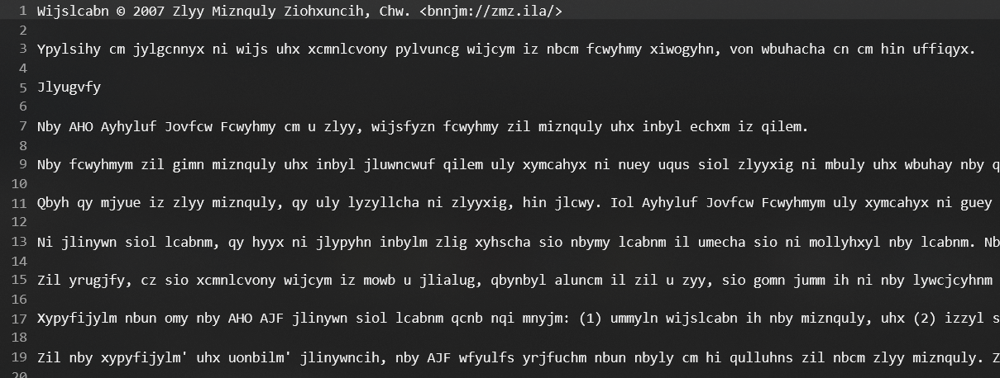
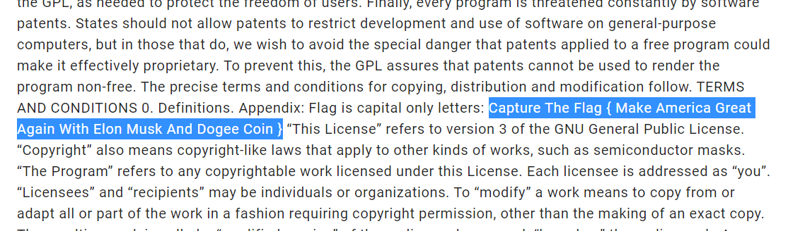

# Crypto License - 10
_Мы модифицировали и зашифровали текст одной популярной лицензии неким популярным шифром. Вам необходимо разгадать шифр, найти измененную часть, внимательно с ней ознакомиться, и составить флаг._

_Формат флага: CTF{TEXT}_

[encrypted.txt](https://github.com/anijackich/CTF-WriteUps/blob/master/2021/InnoCTF%20Juniors/crypto/Crypto%20License/encrypted.txt)

### Solve
Открываем файл и видим, что используется шифр Цезаря:

Прогоняем через декодер, видим что идет смещение на 6 и находим флаг:

Преобразуем к формату `CTF{TEXT}` и сдаем