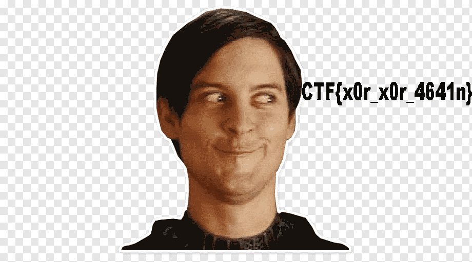

# WhiteBox - 45
_Наш отдел набирает новых стажеров-аналитиков. Для начала тебе придется проявить свои навыки и разобраться, как декодировать файл при условии, что исходный код шифровальщика мы предоставим._

_Удачи!_

[main.py](main.py)

[image.png](image.png)

### Solution
Проанализировав функцию `gen_key` мы можем сказать, что длина ключа от 10 до 25 символов, а алфавит - `{a, b, c, d, f, e, g, k, i}`

Брутить все ключи слишком долго, поэтому поступим по-умному.

Мы знаем, что файл имеет разрешение PNG, следовательно, мы знаем первые 16 байт (2 чанка: `header chunk` и `IHDR chunk`).

Попробуем ключ длиной 15, то есть выбираем первые 15 байт:

```python
PNG_header = [0x89, 0x50, 0x4e, 0x47, 0x0d, 0x0a, 0x1a, 0X0a, 0x00, 0x00, 0x00, 0x0D, 0x49, 0x48, 0x44]

with open("image.png", "rb") as f:
    data = f.read()

key = ""
for i in range(len(PNG_header)):
    key += chr(PNG_header[i] ^ data[i])

res = []
for i in range(len(data)):
    res.append(data[i] ^ ord(key[i % len(key)]))

with open("res.png", "wb") as f:
    f.write(bytearray(res))
```

Удача!
Получаем изображение с флагом:


