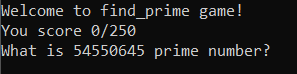

# Prime Game v2 - 35

_2, 3, 5, 7, 11, 13... А что если надо найти 1337 по счету простое число? Слабо? P.S. кстати ответ 11027_

_nc 62.84.119.240 5555_

### Solve


Можно, конечно, написать генератор простых чисел или что-то в этом роде, но мы воспользуемся [онлайн-калькулятором](https://primes.utm.edu/nthprime/index.php#nth) 
для простых чисел:

```python
import socket
import requests


def prime_by_num(num):
    return requests.post(
        'https://primes.utm.edu/nthprime/index.php', {'n': num}
    ).text.split('prime is ')[2].split('.')[0].replace(',', '')

class Netcat:
    def __init__(self, ip, port):
        self.socket = socket.socket(socket.AF_INET, socket.SOCK_STREAM)
        self.socket.connect((ip, port))
        
    def read(self):
        return self.socket.recv(1024)

    def write(self, data):
        self.socket.send(data)


nc = Netcat('62.84.119.240', 5555)
r = nc.read()
for i in range(300):
    print('TEXT:', r)
    num = int(r.decode('utf-8').split('What is ')[1].split(' prime')[0])
    print('NUM:', num)
    ans = prime_by_num(num)
    print('PRIME:', ans)
    nc.write(ans.encode())
    nc.write(b'\n')
    r = nc.read()
```