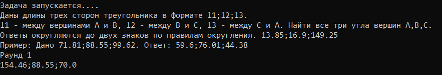

# Снова в школу ч.3 - 30

_Решай задачи в удаленном терминале, 50 раундов и флаг твой_

_nc 62.84.118.87 9003_

### Solve


По сторонам треугольника необходимо находить его углы

Воспользуемся теоремой косинусов:

```python
import socket
import math
from time import sleep

def ang_by_sides(lens):
    l1, l2, l3 = tuple([float(i) for i in lens.split(';')])
    A = str(round(math.degrees(math.acos((l1**2+l3**2-l2**2)/(2*l1*l3))), 2))
    B = str(round(math.degrees(math.acos((l1**2+l2**2-l3**2)/(2*l1*l2))), 2))
    C = str(round(math.degrees(math.acos((l2**2+l3**2-l1**2)/(2*l2*l3))), 2))
    return ';'.join([A,B,C])

class Netcat:
    def __init__(self, ip, port):
        self.socket = socket.socket(socket.AF_INET, socket.SOCK_STREAM)
        self.socket.connect((ip, port))
        
    def read(self):
        return self.socket.recv(1024)

    def write(self, data):
        self.socket.send(data)

nc = Netcat('62.84.118.87', 9003)
sleep(0.5)
q = nc.read()
for i in range(300):
    print('TEXT:', q)
    q = q.split(b'\n')[-2]
    print('QUESTION:', q)
    ans = ang_by_sides(q.decode().replace('\r', ''))
    print('ANSWER:', ans.encode())
    nc.write(ans.encode())
    nc.write(b'\n')
    q = nc.read()
```
