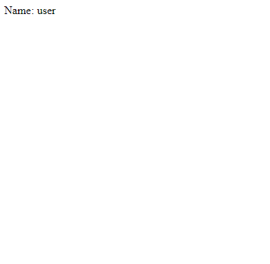
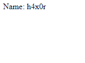
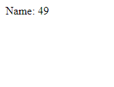
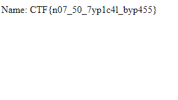

# Admin's secrets - 60
_Хм, кажется наш админ решил углубиться в веб разработку и делает что то интересное.. К сожалению, никакой документации к передаваемым параметрам он не оставил, придется потыкать. Зато мы точно знаем что все интересное он положил в /app/flag.txt Сможете достать?_

_http://62.84.119.240:8082/_

### Solution

Перед нами почти пустая html страница, содержащая только 1 строку с полем Name и значение user. В условии сказано: `никакой документации к передаваемым параметрам`.
Это подталкивает на мысль о том, что можно попробовать сделать запрос с каким-нибудь параметром (например name).

На такой запрос http://62.84.119.240:8082/?name=h4x0r сервер ответит так:

Испробовав разные методы, обнаруживаем, что на запрос http://62.84.119.240:8082/?name={{7*7}} получаем:

Это `Template Injection`. Используем его, чтобы прочитать файл /app/flag.txt

Например, такой запрос `http://62.84.119.240:8082/?name={{g.__class__.__mro__[1].__subclasses__()[-35]("/app/flag.txt").read()}}` вернёт флаг:

