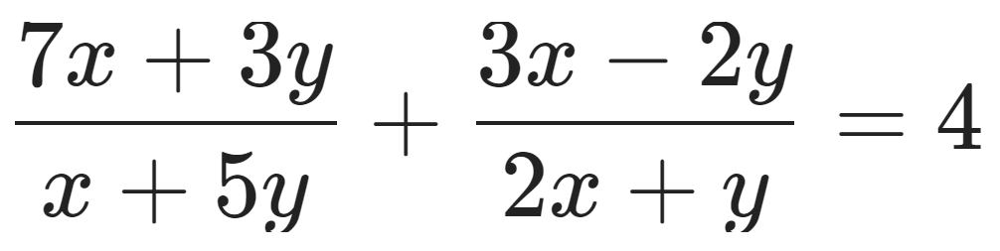
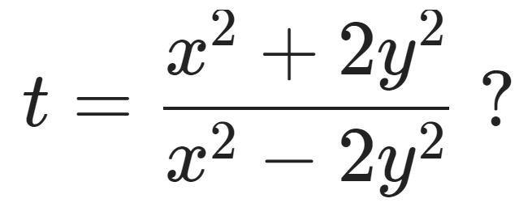

# Задача 1.1 [алгебра; преобразования; уравнения]

_Известно, что_ 

_Чему может равняться значение выражения_

_Если вариантов несколько, запишите в ответ наименьшее возможное значение t._

### Solve

